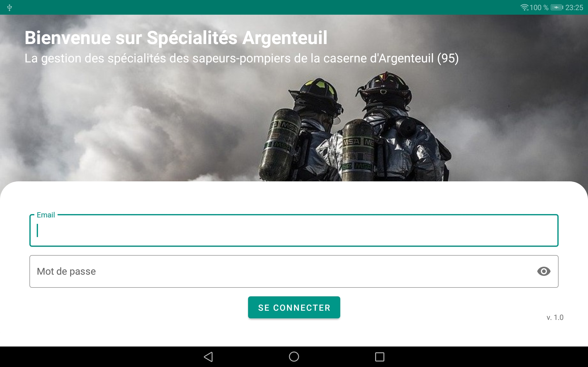
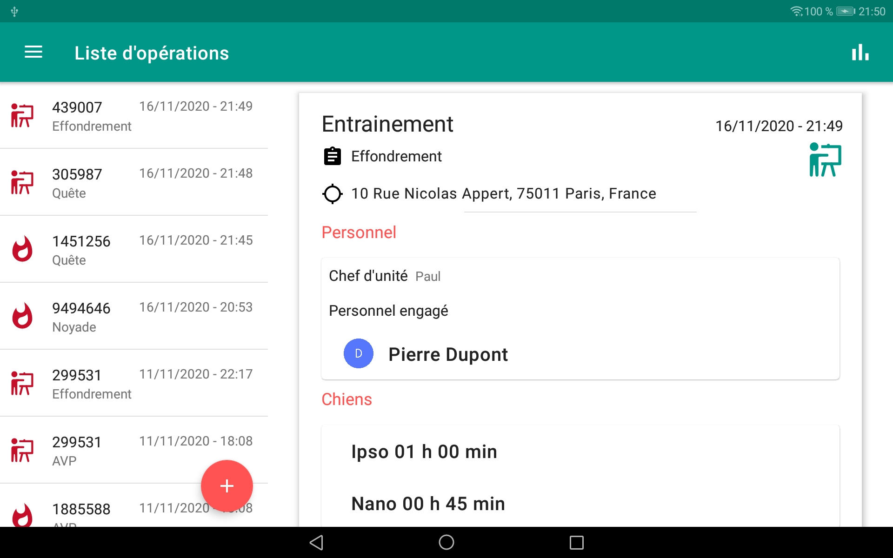
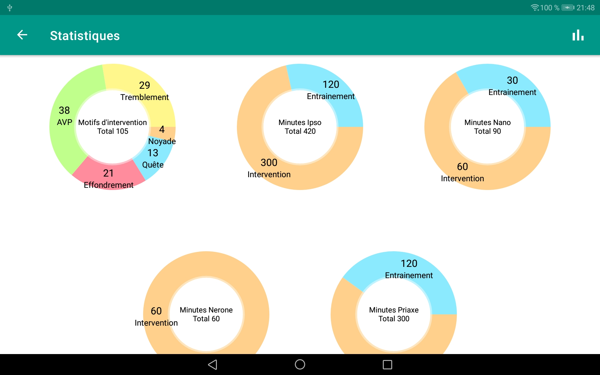
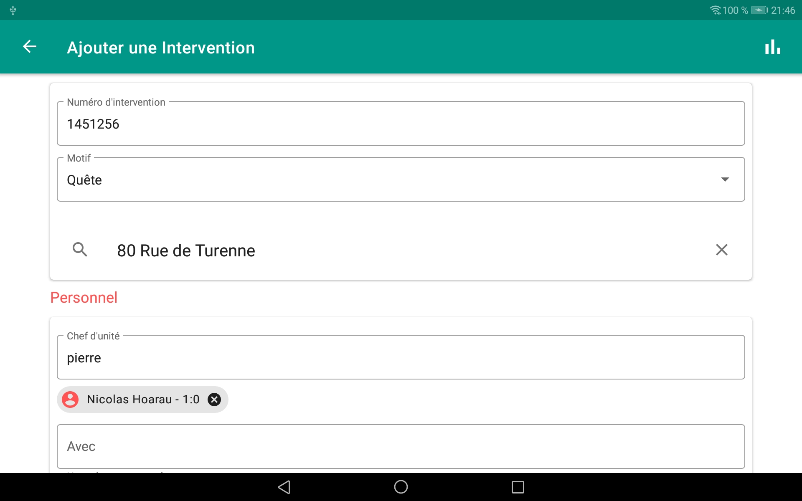
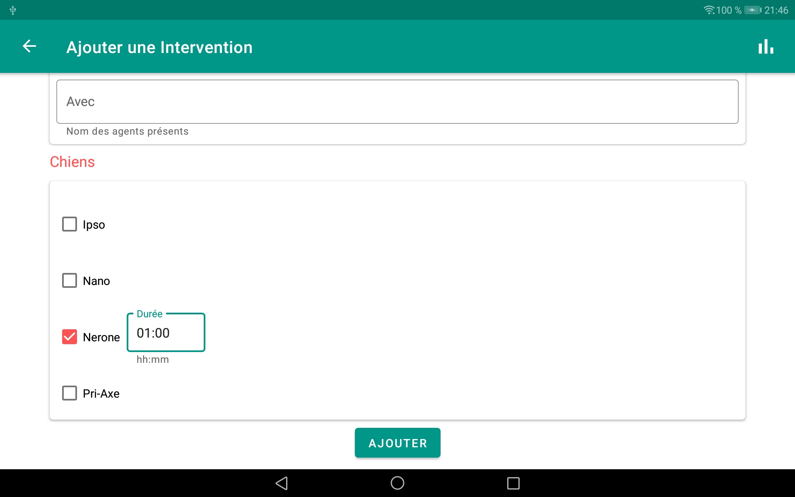

# SPE95

Projet Android pour tablettes permettant à un centre de secours de gérer les interventions de ses spécialités

# Screens

## Fonctionnalités

 - [x] Affichage sous forme de liste de toutes les interventions listées
       chronologiquement
- [x] Affichage du détail de l'intervention
 - [x] Création d'une intervention avec formulaire (numéro d'intervention, adresse, personnel engagé, matériel utilisé)
 - [x] Liste de tous les agents de la caserne avec filtre par spécialité
- [x] Gestion de droits CRUD avec authentification selon profil (reader, writer, admin)
- [x] Réalisation d'un dashboard de statistiques pour chaque spécialité à envoyer à la direction départementale à la fin de l'année
- [ ] Gestion du stock de matériel avec alertes (notifications) lorsqu'un matériel est manquant
- [ ] Carnet de plongée pour chaque agent plongeur
